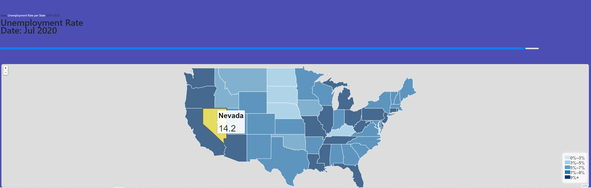

# Rice-U-Project-2
Overview
---------------

*Why Unemployment?*  
Unemployment rate is important gauge of the economy’s growth rate – it measures the effect of economic events, such as recession or in the most recent event, COVID-19. 

General indicators:
  - Low unemployment rate = expanding economy = growth
  - High unemployment rate = decreasing economy = low investment, low hiring
  - Investors use unemployment rates to determine sectors losing jobs faster, and then determine which mutual funds to sell, ultimately influencing stock market, 401k savings and personal savings. 

*What is considered to be “unemployed”*  
The unemployment rate is the number of unemployed divided by the number  in the civilian labor force.
  - To be counted in the unemployment rate, you not only have to be without a job, you have to be actively looking for a work in the past 4 weeks. 
  - If you are temporarily laid off and are waiting to be called back to a job, you’re still counted. 
*What is NOT to  be considered “unemployed”*
  - If you’ve given up looking for work, you’re not counted in the unemployment rate.

*Soure of Truth*
 
US unemployment data was gathered from [The U.S. Department of Labor](https://www.bls.gov/charts/state-employment-and-unemployment/state-unemployment-rates-animated.htm) - **State unemployment rates over the last 10 years, seasonally adjusted**

  - Seasonally adjusted rates : is a statistical method of removing the seasonal component of removing the seasonal component of a time series that is used when analyzing  non-seasonal trends. 

  - Date Range: January 2010 until the most recent date available (October 2020) 

  - Breakdowns: • State • Months / Year • Seasonally Adjusted Rates

  - Geographies in scope: National (United States of America),  52 states.
  
Data Processing 
---------------
**Interpreting the Interactive Map**  
The map shows how moving the slider across different time periods, reflects the changes in state color to demonstrate high/lows of unemployment rates. 

  - Loading department of labor data with unemployment rate per state from 2010-2020 Postgres to flask. 

  - Leveraged JavaScript and leaflet to load and match the geojson data with the coordinates per each state with the unemployment data for each state on a given period of time

**Interpreting the Interactive Map**  
The graph shows how the selected rate (seasonally adjusted) changes over time and across different months/years.  

  - Read csv file into Plotly
  - Leveraged JavaScript/plotly line chart to showcase trend of unemployment rate and compare month to month and be able to highlight events

Conclusion
=============
Unemployment rates were lower in October in 37 states and the District of Columbia, higher in 8 states, and stable in 5 states, the U.S. Bureau of Labor Statistics reported today. Forty-seven states and the District had jobless rate increases from a year earlier and three states had little or no change. The national unemployment rate declined by 1.0 percentage point over the month to 6.9 percent but was 3.3 points higher than in October 2019.

